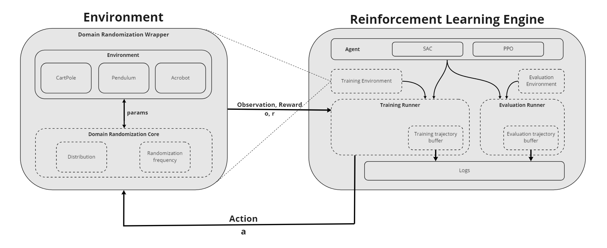
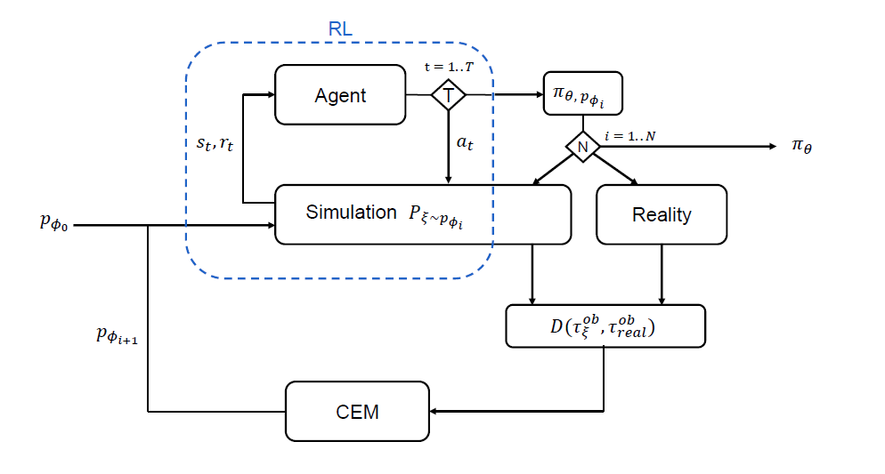

<h1 align='center'><b>Simreal</b></h1>

<p align='center'><sub>
Note: <br> 
Code of the open-source library Simreal is hosted on the <a href='https://github.com/D2LAB-UGent/Simreal'>university's github</a>.<br> 
</sub>
</p>
<p align='center'>
    __
</p>
<p align='center'>
    Simreal is an implementation of Adaptive Domain Randomization (ADR) that aims to address sim-to-real policy transfer in mechatronic systems. It is based on <a href='https://github.com/zuoxingdong/lagom'>lagom</a> and is highly configurable for implementing additional environments & radomization parameters. 
</p>
<p align='center'>
    __
</p>
<p align='center'><sub>
Made by Stijn Woestenborghs for his master's thesis at Ghent University <br> 
Supervisor: prof. df. ir. Guillaume Crevecoeur <br> 
Counsellor: ir. Jeroen Taets
</sub>
</p>

## Project setup

### Prerequisite

1. Python versions and virtual environments are controlled with (the very convenient) [pyenv](https://github.com/pyenv/pyenv). Pyenv installation depends on the OS used:
- MacOS: 
   `brew update`
   `brew install pyenv`
- Windows:
   follow [pyenv-win](https://github.com/pyenv-win/pyenv-win)

### Configure project setup

A virtual environment with all required packages is created by the simple command:

- MacOS: `make setup`
- Windows: `make setup-win` (make sure to use a bash-like shell like `Git Bash` or follow similar commands as in the makefile)

## Simreal

### Entrypoint for Adaptive Domain Randomization
Tho following starts up the main file `src/main.py` in the virtual env:
- MacOS: `make ADR`
- Windows: `make ADR-win`

### About
1. **Environments**: 
> Available environments (under `simreal/envs/`):
> - CustomCartPole-v1
> - CustomPendulum-v0
> - CustomAcrobot-v1  
> 
> Creating an environment:
>```
> import simreal
> env = simreal.make('CustomAcrobot-v1')
>```
>  
>
2. **Reinforcement Learning baselines**
> Available RL baselines (under `simreal/baselines/`):
> - PPO
> - SAC (not supported for ADR) 
>    
> *Note: CEM is the optimization algorithm used by ADR*
> 
3. **Domain Randomization**
> Available randomization parameters:
> | Cartpole                  | Pendulum                  | Acrobot                   |
> |           :---:           |           :---:           |           :---:           |
> | mass cart: $m_{c}$        | mass: $m$                 | mass rod 1: $m_{1}$       |
> | mass pole: $m_{p}$        | length: $l$               | mass rod 2: $m_{2}$       |
> | length pole: $l_{p}$      |                           | length rod 1: $l_{1}$     |
> |                           |                           | length rod 2: $l_{2}$     |
> 
> Implemented as a wrapper (under `simreal/sim2real/domain_randomization_wrapper.py`):
>``` 
> import simreal
> from simreal import DomainRandomization
>
> args = { ... }  # example configurations under: 'src\config.examples'
>
> env = simreal.make('CustomAcrobot-v1')
> env = DomainRandomization(env, args)
>```
>
> An architecture overview that explains domain randomization is usded during RL training: 
>
> 

4. **Noisy wrapper**
> Implemented environment complexity by the noisy wrapper (under `simreal/wrappers/noisy_wrapper.py`):
> - actuation noise
> - observation noise
> - parameter offset
> - friction
> 
> Using the DomainRandomization wrapper:
>``` 
> import simreal
> from simreal import DomainRandomization
>
> args = { ... }  # example configurations under: 'src\config.examples'
>
> env = simreal.make('CustomAcrobot-v1')
> env = DomainRandomization(env, args)
>```


5. **Adaptive Domain Randomization**
> An overview of the implemented framework below. More information in the docs: `doc\Adaptive_Domain_Randomization_for_Sim_to_Real_transfer_in_Mechatronic_Systems.pdf`
>
> 

---
<sub>For more information find me on github: [StijnWoestenborghs](https://github.com/StijnWoestenborghs)  :rocket: </sup>